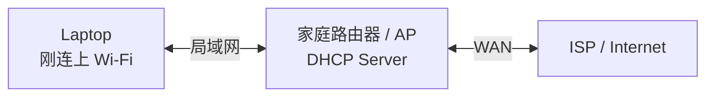

# 00｜电脑刚连上网络时，先拿到了什么？

> 这一章只解决一个问题：
>
> **在你输入 URL 之前，电脑为什么已经知道自己的 IP、子网、默认网关和 DNS Server？**

后面的 URL → DNS → TCP → TLS 全都依赖这些“前置网络参数”。如果这些参数不存在，浏览器甚至不知道 DNS 问谁、远端 IP 应该从哪个网关出去。

> 本章先以最常见的家庭 IPv4 网络为主；IPv6 会单独标出差异。

---

## 0. 先看结果：上网前电脑至少需要这些信息

假设笔记本连上家庭 Wi-Fi，最终可能得到：

```text
本机 IPv4       192.168.1.20
子网掩码        255.255.255.0  (/24)
默认网关        192.168.1.1
DNS Server      192.168.1.1
租约时间        24h
```

这些信息分别回答：

```text
IP：
“我在这个网络里是谁？”

Subnet：
“哪些地址算和我在同一个本地网络？”

Default Gateway：
“目标不在本地时，第一跳交给谁？”

DNS Server：
“域名解析问题先问谁？”
```

---

## 1. 参与者



这里先忽略 Wi-Fi 本身的认证、关联、WPA 加密过程，只关注“已经加入局域网后，如何拿到 IP 配置”。

---

## 2. DHCP：自动获得 IPv4 网络配置

最经典的 DHCP 流程可以记成 DORA：

```text
Client                              DHCP Server

DHCP Discover
“网络里有 DHCP Server 吗？”
   ------------------------------------>

                     DHCP Offer
                     “可以给你 192.168.1.20”
   <------------------------------------

DHCP Request
“我要这个地址”
   ------------------------------------>

                     DHCP ACK
                     “确认，租给你”
   <------------------------------------
```

因此系统得到一份租约：

```text
IP        = 192.168.1.20
Mask      = 255.255.255.0
Gateway   = 192.168.1.1
DNS       = 192.168.1.1
Lease     = ...
```

注意：实际网络可能由企业 DHCP、运营商设备、虚拟网络或手工静态配置提供这些参数，不一定总是家庭路由器。

---

## 3. 为什么一开始没有 IP 也能发 DHCP？

这是 DHCP 很值得注意的地方。

客户端刚加入 IPv4 网络时可能还没有可用 IPv4 地址，所以早期 DHCP 报文会使用广播等机制完成发现。

你现在只需要记住：

> DHCP 是“先解决我是谁以及基础网络参数是什么”的引导协议。

后面学 UDP、IP、广播时再回来看它的报文细节。

---

## 4. 子网决定“直接发”还是“交给网关”

假设：

```text
我的 IP：
192.168.1.20/24
```

则本地网段可以粗略看作：

```text
192.168.1.0/24
```

访问：

```text
192.168.1.50
```

系统发现：

```text
目标和我同子网
        ↓
下一跳就是目标本身
        ↓
ARP 192.168.1.50
```

而访问：

```text
203.0.113.20
```

系统发现：

```text
目标不在本地网段
        ↓
使用默认路由
        ↓
下一跳 = 192.168.1.1
        ↓
ARP 192.168.1.1
```

所以一定不要记成：

> “ARP 永远找默认网关。”

正确的是：

> **Route 先决定下一跳；ARP 再解析这个 IPv4 下一跳的 MAC。**

---

## 5. DNS Server 从哪里来的？

后面我们会看到：

```text
Stub Resolver
      ↓
Recursive Resolver
```

但一个初学者很自然会问：

> 我的电脑怎么知道 Recursive Resolver 的地址？

常见答案之一就是 DHCP。

例如 DHCP 给系统：

```text
DNS Server = 192.168.1.1
```

你的电脑可能先把 DNS 查询发给家庭路由器；路由器再转发给 ISP 或公共 DNS。

也可能 DHCP 直接下发公共/企业 DNS 地址。

现代浏览器如果开启 DoH，还可能绕过系统配置的传统 UDP/TCP DNS 路径，直接访问指定的 DoH Resolver。后面 DNS 章节再展开。

---

## 6. IPv6 怎么办？

IPv6 不照搬 IPv4 DHCP + ARP 模型。

IPv6 常见机制包括：

```text
Router Advertisement (RA)
SLAAC
DHCPv6（视网络而定）
NDP / Neighbor Discovery
```

后面的主线如果 Happy Eyeballs 最终选择 IPv6：

```text
IPv6
 ↓
Route
 ↓
NDP
 ↓
当前链路发送
```

而不是：

```text
IPv6
 ↓
ARP
```

ARP 是 IPv4 语境下的核心机制。

---

## 7. Windows 上可以直接看这些东西

```powershell
ipconfig /all
```

重点找：

```text
IPv4 Address
Subnet Mask
Default Gateway
DNS Servers
DHCP Enabled
DHCP Server
Lease Obtained
Lease Expires
```

再看路由表：

```powershell
route print
```

你会看到默认路由以及本地网络相关路由。

---

## 8. 放回整个主线

```text
电脑加入网络
    ↓
DHCP / 静态配置
    ↓
获得：

本机 IP
子网
默认网关
DNS Server

    ↓
用户输入 URL
    ↓
后面的 DNS / Route / ARP
才有基础数据可用
```

---

## 9. 最容易混淆的地方

1. DHCP 不是 DNS：DHCP 可以告诉你“DNS Server 在哪”，DNS 再负责“域名对应什么地址”。
2. 默认网关不是“所有包都必须经过的设备”：同子网通信可以直接发送。
3. IP 地址不一定永久属于设备：DHCP 通常按租约分配。
4. IPv6 不使用 ARP；邻居解析由 NDP 等机制完成。
5. Wi-Fi 连接成功不等于已经具备完整 IP 网络配置。

---

## 10. 一句话记忆

> **DHCP 先给电脑一张“上网身份证和导航卡”：我是谁、谁和我同网、出远门先找谁、域名问题先问谁。**

---

## 11. 自测

1. 为什么电脑刚连 Wi-Fi 时，不应该假设它已经知道自己的 IPv4 地址？
2. 默认网关解决的是什么问题？
3. DNS Server 地址通常可能从哪里获得？
4. 为什么同一子网访问目标时，ARP 的对象可能就是目标主机，而不是路由器？
5. IPv6 为什么不能继续机械套用 ARP？

---

## 12. 下一章

接下来进入真正的主线：

[01｜从输入 URL 到网页返回](./01-url-to-webpage.md)
