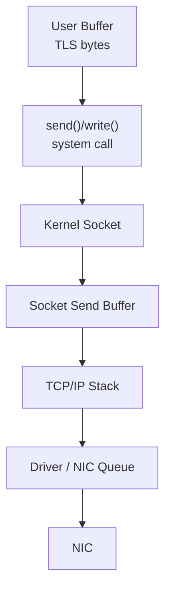
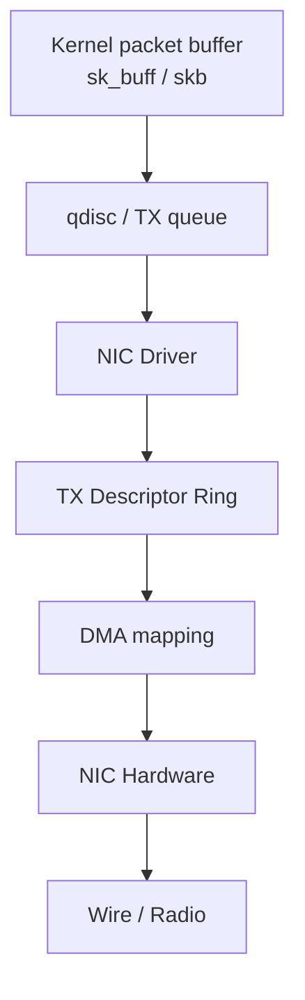
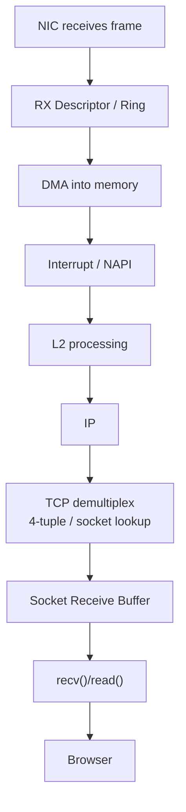

# 02｜网络分层、封装与 OS 收发包：数据到底怎么从进程走到网卡？

> 这一章只解决一个问题：
>
> **浏览器已经有一段要发送的数据，调用 `send()/write()` 之后，这些字节到底怎样穿过用户态、内核、驱动和网卡，最后变成线上真正传输的帧？**

上一章解决的是“从 URL 到服务器”的**大流程**；这一章把镜头拉近，只盯住一台机器内部：

```text
User Process
    ↓
system call
    ↓
Socket
    ↓
TCP
    ↓
IP / Route
    ↓
Neighbor / ARP / NDP
    ↓
qdisc
    ↓
NIC Driver
    ↓
Descriptor Ring / DMA
    ↓
NIC
    ↓
Wire / Wi-Fi
```

> 本章的 Linux 内核部分用于建立实现直觉，不把某个 Linux 版本的实现细节当成协议规范。Windows 的内部模块名字不同，但“应用 → 内核网络栈 → 驱动 → 网卡”的基本边界是相通的。

---

# 0. 先把四种“层次”分开

网络初学者最容易混淆的不是某个协议，而是把四种完全不同的问题混成一张图。

## 0.1 协议分层：谁负责什么语义？

```text
Application
HTTP / DNS / RPC / ...
       ↓
Transport
TCP / UDP
       ↓
Internet
IP / ICMP
       ↓
Link
Ethernet / Wi-Fi / ...
```

回答：

> **每层解决什么问题？**

## 0.2 封装层次：数据外面套了什么头？

```text
Ethernet Frame
└── IP Packet
    └── TCP Segment
        └── TLS Record
            └── HTTP bytes
```

回答：

> **线上这批字节长什么样？**

## 0.3 本机实现路径：谁真正执行代码？

```text
Browser Process
      ↓
System Call
      ↓
Kernel Socket / TCP / IP
      ↓
NIC Driver
      ↓
NIC Hardware
```

回答：

> **代码和状态到底运行在哪里？**

## 0.4 网络空间路径：数据经过哪些设备？

```text
Laptop
 ↓
Home Router
 ↓
ISP
 ↓
Internet Routers
 ↓
Server
```

回答：

> **包在现实网络里经过谁？**

> **一个图只回答一种问题。**  
> 后面所有章节都继续遵守这个规则。

---

# 1. TCP/IP 四层和 OSI 七层到底有什么关系？

OSI 更像一个概念参考模型；互联网实际工程更常用 TCP/IP 分层来理解。

| OSI | TCP/IP 常见对应 | 典型内容 |
|---|---|---|
| 应用层 | 应用层 | HTTP、DNS、RPC |
| 表示层 | 应用层 | 编码、序列化、TLS 的一部分语义常在这里讨论 |
| 会话层 | 应用层 | 会话管理等 |
| 传输层 | 传输层 | TCP、UDP |
| 网络层 | Internet 层 | IPv4、IPv6、ICMP |
| 数据链路层 | 网络接口 / Link 层 | Ethernet、802.11、ARP/NDP 周边机制 |
| 物理层 | 网络接口 / 物理媒介 | 电信号、光信号、无线信号 |

这里最重要的不是背“第几层”，而是理解：

> **分层是一种接口边界。上层只依赖下层提供的能力，不需要知道下层每一步怎么实现。**

例如 HTTP 只需要：

```text
“给我一条可靠的字节流”
```

它不需要知道：

```text
下一跳 MAC
网卡 DMA
路由器 FIB
```

TCP 则依赖 IP：

```text
“帮我尽力把这些 IP 包送到那个 IP”
```

它不需要自己操作交换机。

---

# 2. 为什么一定要分层？

假设完全不分层，一个浏览器开发者可能需要同时处理：

```text
GET /products
+
TLS 密钥
+
TCP 重传
+
IP 路由
+
ARP
+
Wi-Fi 帧
+
网卡寄存器
```

任何底层网络变化都会影响应用。

分层以后：

```text
Browser
只关心 HTTP / TLS / Socket API

Kernel TCP
只关心可靠传输状态

Kernel IP
只关心寻址和路由

Link / Driver / NIC
只关心当前链路如何真正发送
```

于是：

> 换 Wi-Fi、换网卡、换路由器时，HTTP 逻辑不需要重写。

这就是分层最核心的工程价值：

- 降低耦合；
- 每层拥有明确职责；
- 底层实现可以替换；
- 协议可以独立演进；
- 排障时能定位“问题在哪一层”。

---

# 3. 贯穿例子：浏览器已经得到一段 HTTPS 数据

上一章已经完成：

```text
DNS
 ↓
TCP 建连
 ↓
TLS 建立
```

现在浏览器要发送逻辑上的：

```http
GET /products HTTP/1.1
Host: shop.example.com
```

但这是 HTTPS。

因此浏览器/TLS 库会先把 HTTP 数据处理成 TLS Record，线上不会直接出现 HTTP 明文。

简化后：

```text
HTTP bytes
    ↓
TLS encrypt
    ↓
TLS record bytes
    ↓
send(socket, bytes)
```

> 常见浏览器/TLS 库主要运行在用户态；Linux 也存在 kTLS、NIC TLS offload 等优化，但那是后续进阶分支，不改变我们现在要建立的主模型。

---

# 4. send() 的真正含义：不是“立刻把数据扔到网线上”

应用调用：

```c
send(fd, buffer, len, ...);
```

初学者很容易脑补成：

```text
send()
 ↓
网卡立刻发送
```

实际更接近：



系统调用意味着：

> CPU 从用户态代码进入内核态，要求内核替这个进程执行受保护的网络操作。

很多普通发送路径中，内核会把用户提供的数据复制/引用到内核管理的缓冲结构，再由协议栈异步继续处理。

因此：

> **send() 返回，不等于对方已经收到，甚至不等于数据已经真正离开网卡。**

它可能只意味着：

> 内核已经接受了这些待发送数据。

---

# 5. fd / Socket / TCP Connection 三者不要混

进程看到：

```text
fd = 57
```

内核里真正维护：

```text
Socket Object
 ├─ local IP / port
 ├─ remote IP / port
 ├─ TCP state
 ├─ send buffer
 ├─ receive buffer
 └─ protocol state
```

关系：

```text
Process
  │
  │ fd = 57
  ▼
Kernel File / Socket reference
  │
  ▼
TCP Socket State
```

所以：

- fd 是进程使用的句柄；
- socket 是内核网络对象；
- TCP connection 是双方围绕四元组、序列号、窗口等维护的一整套通信状态。

一个进程可以拥有大量 fd，也就可以拥有大量 socket。

---

# 6. 从用户数据到 TCP Segment

对于已经建立的 TCP 连接：

```text
TLS bytes
   ↓
Socket send buffer
   ↓
TCP
```

TCP 会维护：

- Sequence Number；
- Acknowledgment；
- Window；
- 重传状态；
- 拥塞控制状态；
- MSS 等。

逻辑上，TCP 会把连续字节流组织成适合发送的 segment。

```text
TCP Segment
┌─────────────────────────────┐
│ TCP Header                  │
│ src port / dst port         │
│ seq / ack                   │
│ flags / window / options    │
├─────────────────────────────┤
│ payload: TLS bytes          │
└─────────────────────────────┘
```

注意：

> TCP 面向的是**字节流**，应用一次 send() 并不天然对应网络上一个 TCP Segment。

内核可能：

- 合并多次应用写入；
- 拆分大块数据；
- 因拥塞窗口暂缓发送；
- 因 Nagle、cork、调度策略等改变发送时机；
- 使用 GSO/TSO 把部分分段工作推迟到更低层甚至网卡。

因此：

```text
一次 send()
≠
一个 TCP 包
```

---

# 7. MSS：TCP 为什么不能随便塞无限多数据？

TCP 建连时常会协商 MSS。

在一个最典型的以太网 IPv4、无额外 IP/TCP options 示例中：

```text
Ethernet MTU = 1500 bytes
IPv4 Header  =   20 bytes
TCP Header   =   20 bytes

MSS ≈ 1460 bytes
```

也就是：

```text
1500
 -20 IP
 -20 TCP
───────
1460 TCP payload
```

IPv6 基础头更大，因此同样 1500 MTU 下常见基础 MSS 会不同。

但不要把 1460 当成宇宙常量：

- Path MTU 可能不是 1500；
- IP/TCP options 会占空间；
- VPN/隧道会增加额外封装；
- PMTUD 会影响实际可用大小；
- GSO/TSO 让内核内部看到的“逻辑大 skb”可能暂时大于线上的实际单帧大小。

---

# 8. MTU 到底限制谁？

在 Ethernet 语境里，常说：

```text
MTU = 1500
```

主要表示这一链路允许承载的 L3 packet 大小上限（常见以太网示例）。

不要理解成：

```text
整个 Ethernet Frame 一共只能 1500 字节
```

因为 Ethernet 自己还有 L2 Header 等开销。

简化关系：

```text
Ethernet Frame
┌────────────────────────────┐
│ Ethernet Header            │
├────────────────────────────┤
│ IP Packet <= MTU           │
│ ┌────────────────────────┐ │
│ │ IP Header              │ │
│ ├────────────────────────┤ │
│ │ TCP Segment            │ │
│ │ ┌────────────────────┐ │ │
│ │ │ TCP Header         │ │ │
│ │ ├────────────────────┤ │ │
│ │ │ Payload            │ │ │
│ │ └────────────────────┘ │ │
│ └────────────────────────┘ │
├────────────────────────────┤
│ FCS / 链路开销（视语境）    │
└────────────────────────────┘
```

---

# 9. 为什么更希望 TCP 依据 MSS 分段，而不是依赖 IP Fragmentation？

考虑一个较大的 TCP 数据块。

如果 IP 层产生多个 fragment：

```text
IP Datagram
   ↓
Fragment A
Fragment B
Fragment C
```

如果 B 丢失，接收端无法重组出完整原始 IP 数据报。

TCP 看不到完整 segment，也就无法确认对应数据。

这会让恢复过程更低效。

因此现代 TCP 通常尽量结合：

- MSS；
- Path MTU Discovery；
- PMTU 信息；

避免不必要的 IP fragmentation。

还要区分 IPv4 和 IPv6：

- IPv4 历史上允许路由器在一定条件下分片；
- IPv6 路由器不会像 IPv4 那样沿途分片，源端需要基于 PMTU 等机制处理大小问题。

所以一句话：

> **MTU 是链路/路径大小约束；MSS 是 TCP 为了适配下层路径而控制 payload 大小的重要参数。**

---

# 10. TCP Segment 再被 IP 包住

TCP 输出交给 IP：

```text
IP Packet
┌──────────────────────────────┐
│ IP Header                    │
│ src IP = 192.168.1.20        │
│ dst IP = 203.0.113.20        │
│ protocol = TCP               │
├──────────────────────────────┤
│ TCP Segment                  │
└──────────────────────────────┘
```

IP 层此时必须回答：

> **这个目标 IP 应该从哪个接口、经过哪个下一跳发送？**

因此会查路由。

---

# 11. Route 在内核发送路径中的位置

目标：

```text
203.0.113.20
```

内核根据路由信息选择：

```text
egress interface
next hop
source address（必要时）
```

典型家庭网络：

```text
dst = 203.0.113.20
       ↓
route lookup
       ↓
default route
       ↓
next hop = 192.168.1.1
       ↓
egress = Wi-Fi / Ethernet interface
```

因此上一章的：

```text
Route → ARP
```

现在可以放进 OS 内部实现链：

```text
IP
 ↓
Route lookup
 ↓
Neighbor lookup
 ↓
ARP cache / NDP cache
```

---

# 12. Neighbor：为什么内核知道下一跳 IP 后还没结束？

当前链路如果是 IPv4 Ethernet：

```text
next hop IPv4
    ↓
ARP / neighbor cache
    ↓
next hop MAC
```

如果缓存已有：

```text
192.168.1.1 → AA:BB:CC:DD:EE:FF
```

不必每次广播 ARP。

如果没有，则触发邻居解析。

IPv6 则进入 NDP / Neighbor Discovery 体系，不使用 ARP。

---

# 13. Link Layer：真正准备当前这一跳的 Frame

IPv4 Ethernet 示例：

```text
Ethernet Frame
┌─────────────────────────────────┐
│ dst MAC = Router MAC            │
│ src MAC = Laptop MAC            │
│ EtherType = IPv4                │
├─────────────────────────────────┤
│ IP Packet                       │
│ src IP = 192.168.1.20           │
│ dst IP = 203.0.113.20           │
│                                 │
│ TCP 53124 → 443                 │
└─────────────────────────────────┘
```

注意：

```text
MAC → 当前这一跳
IP  → 端到端逻辑目标
```

如果本机是 Wi-Fi，无线链路上的 802.11 frame 格式与 Ethernet frame 并不完全相同。

所以更通用的表达应该是：

```text
L2 Frame
```

本教程为了最容易建立直觉，经常使用 Ethernet 作为具体示例。

---

# 14. Netfilter / Firewall 在哪里？

在 Linux 中，IP 数据包经过协议栈时可能穿过 Netfilter hooks。

这使得系统可以实现：

- firewall；
- packet filtering；
- NAT；
- connection tracking；
- policy routing 周边能力。

因此真实内核路径并不是只有：

```text
TCP
 ↓
IP
 ↓
NIC
```

更接近：

```text
TCP
 ↓
IP
 ↓
Routing
 ↓
Netfilter / policy hooks
 ↓
Neighbor
 ↓
qdisc
 ↓
Driver
```

具体 hook 顺序、namespace、bridge/netfilter 等会非常复杂，本章只建立“防火墙/NAT 并不是魔法，它们位于真实内核数据路径中”的认知。

---

# 15. qdisc：为什么内核不一定马上把包交给驱动？

Linux 出站路径还有一个容易被忽略的角色：

> **queueing discipline，qdisc**

它可以负责：

- 排队；
- 调度；
- shaping；
- traffic control；
- 丢包策略等。

所以：

```text
“TCP/IP 已经生成 packet”
```

也不等于：

```text
“NIC 现在立刻发”
```

中间还可能有软件队列与调度。

---

# 16. Driver、Descriptor Ring、DMA：软件怎么真正把数据交给网卡？

来到最底层。

简化发送路径：



可以把 TX Ring 想成：

> **CPU/驱动和 NIC 共享的一组“待发送任务描述符”。**

其中 descriptor 会告诉 NIC：

```text
数据在哪里
长度多少
需要什么 offload
```

DMA 的核心价值：

> NIC 可以直接访问指定内存区域搬运数据，不需要 CPU 一个字节一个字节拷给网卡。

所以最终：

```text
CPU / Kernel
负责准备与描述任务

NIC
通过 DMA 获取数据并真正发到介质
```

---

# 17. 一个非常重要的实现对象：sk_buff

Linux 网络栈常用 `struct sk_buff`（skb）描述网络数据。

初学时不要死背字段。

只需要理解它为什么存在：

```text
同一批数据
从 TCP
  ↓
IP
  ↓
L2
```

每层都要增加/读取自己的 header。

如果每过一层都重新申请一块全新内存并完整复制：

```text
Application bytes
 ↓ copy
TCP object
 ↓ copy
IP object
 ↓ copy
Ethernet object
```

会非常昂贵。

skb 的设计允许内核围绕一块网络数据维护：

- 数据指针；
- header 位置；
- 长度；
- 协议元数据；
- 路由/设备信息；
- offload metadata；

让不同协议层围绕同一个 packet buffer 工作。

> 真实 skb 实现远比这复杂，但“减少不必要的数据复制 + 共享 packet metadata”是值得先建立的直觉。

---

# 18. 为什么抓包看到的包，有时和内核里的“包”大小不一样？

因为现代网卡和内核大量使用 offload。

## 18.1 TSO / GSO：发送方向

内核可能暂时维护一个很大的逻辑 TCP 数据块：

```text
Large TCP data
      ↓
GSO / TSO
      ↓
最后在软件较低层或 NIC
拆成多个线上 segment/frame
```

因此某些抓包位置可能看到：

> “怎么一个 packet 大得离谱？”

不一定真的是这个超大 Frame 被原样发上网线。

## 18.2 GRO：接收方向

多个相近的小 packet 可能在内核较早阶段被合并：

```text
packet A
packet B
packet C
   ↓
GRO
   ↓
一个更大的逻辑 skb
```

方便后续协议栈批量处理，降低 CPU 开销。

这也是为什么：

> **抓包位置不同，看到的数据形态可能不同。**

---

# 19. 完整发送路径：从 Browser 到 NIC

现在把全部东西串起来。

```text
┌──────────── User Space ────────────┐

Browser
  │
  │ HTTP bytes
  ▼
TLS Library
  │
  │ TLS records
  ▼
send(fd, data)

└──────────────┬─────────────────────┘
               │ syscall
               ▼
┌──────────── Kernel Space ──────────┐

Socket
  ↓
Send Buffer
  ↓
TCP
  │ seq / ack / window / MSS
  ↓
IP
  │ src/dst IP
  ↓
Route Lookup
  │ next hop / egress
  ↓
Netfilter / policy
  ↓
Neighbor
  │ ARP / NDP
  ↓
L2
  ↓
qdisc / TX queue
  ↓
NIC Driver
  ↓
TX Descriptor Ring
  ↓
DMA mapping

└──────────────┬─────────────────────┘
               ▼
┌──────────── Hardware ──────────────┐

NIC
  ↓
Ethernet / Wi-Fi / Physical medium

└────────────────────────────────────┘
```

这就是上一章：

```text
TCP → IP → Route → ARP → Ethernet
```

在操作系统内部真正展开后的样子。

---

# 20. 接收方向：网卡收到 Frame 后怎么找到 Chrome？

现在反过来。



---

# 21. NIC 收到包后为什么不每个包都硬中断 CPU？

最朴素的模式：

```text
每收到一个包
 ↓
硬件中断 CPU
 ↓
CPU 处理
```

在高包速下会产生巨大的中断开销。

Linux 使用 NAPI 等机制把：

```text
中断通知
+
批量轮询
```

结合起来。

建立直觉：

```text
NIC：
“有数据了！”

CPU / Driver：
“知道了，先暂时别每个包都来打断我，
我批量 poll 一些 RX 数据。”
```

这样能降低 interrupt storm 带来的开销。

---

# 22. RX Ring + DMA：网卡把数据放哪里？

网卡不能凭空把 Frame 交给 TCP。

驱动会维护 RX descriptors / buffers。

简化：

```text
NIC
 ↓
通过 DMA
 ↓
写入系统内存中的接收 Buffer
 ↓
RX Ring descriptor 指向这些 Buffer
 ↓
Driver / NAPI 取出
 ↓
交给协议栈
```

所以 DMA 同样是接收方向的核心。

---

# 23. 内核怎么知道这个包属于哪个 Socket？

收到：

```text
src = 203.0.113.20:443
dst = 192.168.1.20:53124
protocol = TCP
```

内核 TCP 层根据连接状态和地址/端口信息找到对应 socket。

逻辑：

```text
Frame
 ↓
IP Packet
 ↓
TCP Segment
 ↓
connection lookup
 ↓
Socket(fd 57 对应的内核对象)
 ↓
Receive Buffer
```

然后应用调用：

```c
recv(fd, buffer, len, ...);
```

把收到的数据交回用户空间。

---

# 24. TLS / HTTP 在接收方向发生什么？

内核 TCP 提供给浏览器的是：

> **按 TCP 语义恢复后的字节流。**

这些字节仍然是 TLS records。

因此：

```text
Kernel TCP bytes
      ↓
recv()
      ↓
Browser / TLS Library
      ↓
TLS authenticate + decrypt
      ↓
HTTP/1.1 bytes 或 HTTP/2 frames
      ↓
Browser HTTP stack
      ↓
HTML / CSS / JS / image ...
```

所以 HTTPS 并不是：

> 网卡一收到就直接得到 HTML。

中间还要经历 TCP 重组、TLS 解密、HTTP 解析。

---

# 25. “解封装”不是简单把头一层层删除这么机械

教学图常画：

```text
Ethernet Header
 ↓ 去掉
IP Header
 ↓ 去掉
TCP Header
 ↓ 去掉
Application Data
```

这个方向可以帮助理解，但真实实现还包含：

- 校验；
- 状态查找；
- 重组；
- 去重；
- 排序；
- ACK；
- flow control；
- socket buffer；
- offload；
- firewall/policy；
- TLS 验证与解密。

所以更准确的词是：

> **每层解析自己负责的协议头和状态，再把 payload/语义交给上层。**

---

# 26. 一张“封装 vs 实现”的对应图

```text
【应用看到】

HTTP Request
      │
      ▼
TLS encrypted bytes
      │
      ▼
send(fd)


【Kernel 处理】

Socket
      │
      ▼
TCP Segment
      │
      ▼
IP Packet
      │
      ▼
Route / Neighbor
      │
      ▼
L2 Frame


【Hardware】

TX Ring / DMA
      │
      ▼
NIC
      │
      ▼
Wire / Radio
```

这三块不要混成：

```text
HTTP 是浏览器
TCP 是路由器
IP 是网卡
```

这种“一个层 = 一个设备”的错误理解。

同一台电脑内部就同时实现了：

```text
Application
Transport
Internet
Link
```

多个层次。

---

# 27. Windows 和 Linux 到底差在哪？

本教程后续实验会同时给 Windows / Linux 命令，但内核实现章节以 Linux 为主要示例，因为公开资料、工具和源码生态更方便教学。

你可以先记：

```text
共同抽象：

Application
 ↓
Socket API
 ↓
Kernel Network Stack
 ↓
Driver
 ↓
NIC
```

而：

```text
sk_buff
NAPI
qdisc
netfilter
```

这些是 Linux 体系中的具体实现/机制名字。

Windows 有自己的网络栈、驱动模型和过滤框架，不应该把 Linux 名词强行套过去。

---

# 28. 本章最容易混淆的 12 个点

1. **协议层次 ≠ 设备路径。**
2. **send() 返回 ≠ 数据已经到达服务器。**
3. **一次 send() ≠ 一个 TCP Segment。**
4. **fd ≠ port；fd 是进程句柄，port 是传输层地址的一部分。**
5. **Socket ≠ TCP Header；Socket 是内核状态对象。**
6. **MTU 不是“整个 Ethernet Frame 总大小固定等于 1500”。**
7. **1460 MSS 只是典型 IPv4/Ethernet 基础示例，不是常量。**
8. **IPv4 fragmentation 与 TCP segmentation 不是一回事。**
9. **Route 在内核里决定下一跳；ARP/NDP 解析当前链路邻居。**
10. **qdisc / Driver / DMA / NIC 都在“IP 包已经存在”之后。**
11. **抓包看到大 packet 可能与 GSO/TSO/GRO 有关。**
12. **Linux 的 skb/NAPI/netfilter 是实现机制，不等于协议标准本身。**

---

# 29. 一句话记忆

> **应用只把字节交给 Socket；内核负责 TCP/IP、路由和链路邻居；驱动负责把内核准备好的网络数据交给 NIC；NIC 再通过 DMA 和物理链路真正把 Frame 发出去。**

---

# 30. 本机实验：把抽象映射到真实机器

## Windows

### 看本机地址和网卡

```powershell
ipconfig /all
```

你要找：

```text
IPv4 Address
Subnet Mask
Default Gateway
DNS Servers
Physical Address
```

### 看连接与端口

```powershell
netstat -ano
```

观察：

```text
Local Address
Foreign Address
State
PID
```

把它和：

```text
进程
 ↓
socket
 ↓
local IP:port
remote IP:port
```

对应起来。

### 看路由

```powershell
route print
```

### 看邻居 / ARP

```powershell
arp -a
```

---

## Linux

### Socket

```bash
ss -ntp
```

### Route

```bash
ip route
```

### Neighbor

```bash
ip neigh
```

### NIC / MTU

```bash
ip link
```

你会看到类似：

```text
mtu 1500
```

---

# 31. 一个很有价值的 Wireshark 实验

访问一个 HTTPS 网站并抓包。

尝试找到：

```text
DNS
 ↓
TCP SYN
 ↓
SYN, ACK
 ↓
ACK
 ↓
TLS ClientHello
 ↓
TLS ServerHello
 ↓
Application Data
```

然后问自己：

1. 为什么抓不到 HTTPS HTTP body 明文？
2. ClientHello 的 SNI 能否看到？（未使用 ECH 的经典场景）
3. SYN 的源端口是不是一个临时端口？
4. IP dst 是远端服务器/边缘节点，但 Ethernet dst 为什么可能是网关 MAC？
5. 抓包点是在主机协议栈的哪个位置？它会不会受到 offload 影响？

---

# 32. 自测

1. `send()` 返回为什么不能证明服务器已经收到数据？
2. fd、socket、port、TCP connection 四者分别是什么？
3. 为什么“一次 send = 一个 TCP 包”是错误的？
4. MTU 和 MSS 分别限制什么？
5. 为什么 TCP 希望避免依赖 IP fragmentation？
6. Route、Neighbor、Driver、NIC 的顺序和职责分别是什么？
7. DMA 解决了什么问题？
8. NAPI 为什么比“每包一个硬中断”更适合高包速场景？
9. 为什么 Wireshark 可能看到看似超过 MSS/MTU 的“大包”？
10. 收包时，内核最终靠什么把 TCP 数据送到正确 socket？

---

# 33. 下一章

下一章把镜头从“一台机器内部”重新拉回网络：

> **03｜IP、CIDR、Route、ARP/NDP、ICMP、NAT：一个 IP 包为什么真的能找到另一台机器？**

重点会回答：

```text
IP 地址为什么分网络号/主机号？
CIDR 怎么算？
最长前缀匹配是什么？
默认路由为什么是 0.0.0.0/0？
ARP Cache 怎么工作？
ping / traceroute 在做什么？
NAT 返回包怎么找到正确内网连接？
```

---

# 34. 延伸阅读

主要参考知识覆盖：

- xiaolincoder/CS-Base · TCP/IP 网络模型
- xiaolincoder/CS-Base · Linux 系统如何收发网络包
- xiaolincoder/CS-Base · 键入网址到网页显示
- xiaolincoder/CS-Base · TCP 三次握手与 MSS

具体链接见 [SOURCES.md](./SOURCES.md)。
